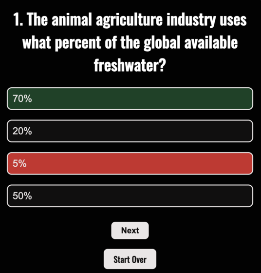

# 

# Climate Trivia

### The Climate Triva Quiz is designed to test the user's knowledge of the environmental impact humans have on the earth's climate. The quiz presents the user with a random question displaying four possible answers with only one being correct. The game ends at 10 questions and presents a user with the correct number of questions answered.

## Finished site deployment link can be found [here](https://cbstange.github.io/climate-trivia/)

## Planning

- Before starting the project I created a [wireframe](.//assets/planning/Climate_Quiz_Wireframe.pdf) and [flowchart](.//assets/planning/Climate_Quiz_Flowchart.pdf) to visualize the user journey - these documents  can be found in the credits below.
- Some of the questions are custom while others were used from other sources. For the custom questions, I reasearched a number of sources regarding climate change and human impact. These sources can be found below in the credits section.

## Existing Features
- Start Page with introduction and play button
  

- Color of the answer selection turns green or red depending on if it is correct or incorrect. If the user chooses an incorrect answer, the correct answer is highlighted in green.
- Once user selects an answer, the "next button" appears and the user cannot change their answer,

- "Start Over" button: User can cancel the game and return to the beginning at anytime.

- Quiz finished: Correctly answered questions out of total questions are displayed and a link to learn more about reducing carbon footprint appears.

## Future Features
- Option to create a username.
- Randomize questions.
- List of the most recent high scores with associated username.
- Pull questions from a trivia API instead of hard-coding questions manually.

## Testing & Bugs
- With each new JavaScript addition, console.log was performed to confirm expected behavior.
- 
- After multiple failed attempts at randomizing the question generated, the feature was pended for a future version.

## Validator Testing

#### HTML
- No errors were returned when passing through the official W3C validator.

#### CSS
- No errors were found when passing through the official (Jigsaw) validator.

#### Javascript
- No errors were returned when passing through the Jshint validator. There were a number of warnings regarding which browser version should be used when viewing the application.

#### Accesibility
-WAVE and Lighthouse were used in Chrome to test accessibility of the site.

## Credits
### Media
- Images were sourced from [Unsplash](https://unsplash.com/) which is a site that provides free images so there are no copywrite violations.
- Icons were obtained by [Font Awesome](https://fontawesome.com/).
  
  
### Development
  - GIT was used for version control.
  - CodeAnywhere was the IDE used for development.

### Content
- Fonts were sourced from [Google Fonts.](https://fonts.google.com/)
- Text and background colors were sourced from [Coolors.](https://coolors.co/)
- Quiz questions were used from the following sources:
  - [Earch Science Communications](https://climatekids.nasa.gov/trivia/).
  - [Gwendolyn MS via Quizizz](https://quizizz.com/admin/quiz/5c53a440922bc3001aad4332/human-impact-and-climate-change)
  - [United Nations](https://www.un.org/en/climatechange/science/climate-issues/water?gclid=CjwKCAjw8symBhAqEiwAaTA__Ms_NOFVcvk8jnfIt2p-OJrMCG8CyQIhx3O1gcv4USdn_Wto99yS7hoCWpcQAvD_BwE)
- "Learn more" link on the game over page [COTAP](https://cotap.org/reduce-carbon-footprint/?gclid=CjwKCAjw8symBhAqEiwAaTA__LNqZ277tDAIWwUQsUjMFmC7Dl__nbYg35KHlqZJxUyYVnbahI6dKBoCoC8QAvD_BwE).
- Basic Javascript logic for the game was inspired by a [YouTube](https://www.youtube.com/watch?v=zZdQGs62cR8) tutorial by "James Q Quick".
- CSS reset properites sourced from [Meyer Web](http://meyerweb.com/eric/tools/css/reset/).
- Wireframes were created using [Balsamiq](https://balsamiq.com/).
- Flowchart was created using [Lucid Chart](https://lucidchart.com/).
